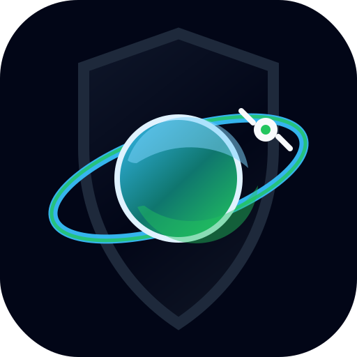

<p align="center">
  
</p>

<h1 align="center">OrbitGuard</h1>

<p align="center">
  <strong>Orbital Risk Intelligence Platform</strong><br>
  Satellite tracking concepts, debris awareness, mission design, and space sustainability in one interactive web app.
</p>

<p align="center">
  <a href="https://orbitguard.vercel.app"><strong>Live Demo</strong></a>
  · <a href="docs/API.md">API Docs</a>
  · <a href="docs/ROADMAP.md">Roadmap</a>
  · <a href="docs/TESTING.md">Testing</a>
</p>

<p align="center">
  
  
  
  
  
</p>


## Overview

OrbitGuard is a space sustainability web app for exploring how satellite launches, debris, rocket bodies, altitude bands, and space weather affect the long-term safety of Earth orbit. It uses public orbital catalog data and educational simulation models to turn orbital risk into something visible, interactive, and easier to understand.

OrbitGuard is not an operational collision-avoidance product. It is a transparent educational and portfolio-grade aerospace platform for learning about orbital congestion, launch impact, mission design, debris awareness, and responsible space operations.

## Key Features

- **Cinematic brand intro** with the official OrbitGuard logo, subtle star motion, orbit lines, mission-status text, and a fast skip path.
- **Autonomous Mission Design Studio** for generating satellite mission architectures, comparing tradeoffs, previewing orbit designs, saving scenarios, and exporting reports.
- **Live Orbit Dashboard** for exploring CelesTrak catalog summaries, object classes, crowded altitude shells, risk bands, and a 3D Earth orbit viewer.
- **Launch Impact Simulator** for testing satellite count, altitude, inclination, mission lifetime, fragments, deorbit planning, and rocket-body disposal.
- **Mission Replay Mode** for watching simulated launch phases, orbit insertion, payload deployment, risk changes, and mission autopsy summaries.
- **Space Traffic Control Center** for simulated conjunction alerts, avoidance maneuvers, orbital health maps, traffic forecasts, operator views, and command logs.
- **Weather Ops** for NOAA space-weather data and ground-station weather effects on drag, communications, optical tracking, and laser-link reliability.
- **Space Encyclopedia** with 200 curated aerospace topics, search/filtering, on-demand article generation, browser caching, and live-data fact checks.
- **Exports** for JSON, CSV, KML, and TXT reports across major app modes.

## Screenshots

| Mission Design Studio | Orbit Dashboard |
| --- | --- |
|  |  |

| Launch Simulator | Space Traffic Control |
| --- | --- |
|  |  |

## Tech Stack

- **Frontend:** HTML, CSS, JavaScript
- **3D / Canvas:** Three.js, procedural canvas graphics, lightweight generated geometry
- **Backend / Local API:** Node.js
- **Data:** CelesTrak SATCAT, NOAA SWPC, educational mission and weather models
- **Deployment:** Vercel static hosting with lightweight API routes
- **Exports:** JSON, CSV, KML, TXT
- **Brand System:** Space Grotesk, Orbitron, JetBrains Mono, Sacramento signature accent

## How To Run Locally

```bash
git clone https://github.com/harshithpr/orbitguard.git
cd orbitguard
npm install
npm run build
npm start
```

Then open:

```text
http://localhost:4173
```

The app is meant to run through the local server or the live Vercel URL. Opening `index.html` directly with `file://` can limit browser fetch/API behavior.

## Update The Orbital Dataset

```bash
npm run update-data
```

This downloads public CelesTrak SATCAT data, filters usable non-decayed Earth-orbiting objects, and writes:

```text
data/orbitguard-data.json
```

OrbitGuard also includes a scheduled GitHub Actions workflow that refreshes this catalog every day and pushes the changed dataset when CelesTrak has new records. The website header includes a CelesTrak status button that checks a lightweight OrbitGuard API endpoint against the live public SATCAT feed when visitors want to verify freshness.

## API Preview

```text
GET  /api/v1/health
GET  /api/v1/summary
GET  /api/v1/objects?band=500-600&type=debris
GET  /api/v1/bands?size=100
GET  /api/v1/time-machine?year=2005
GET  /api/v1/weather/space
GET  /api/v1/sustainability?satellites=24&altitude=550&inclination=53
POST /api/v1/simulate
```

See [docs/API.md](docs/API.md) for full endpoint details.

## About The Creator

OrbitGuard was built by **Harshith Pranav Praveen**, a high school student interested in aerospace engineering, physics, mathematics, engineering design, and software development. The project connects orbital mechanics, public space data, mission simulation, and space sustainability into one interactive platform.

## Roadmap

- Add SGP4 propagation from live GP/TLE data
- Add PDF exports for mission and traffic reports
- Improve the 3D orbit viewer with stronger level-of-detail controls
- Add historical debris-event replay datasets
- Add a Kessler cascade simulator
- Add satellite pass prediction by user location
- Expand space-weather integration with stronger drag modeling
- Replace educational drag scaling with a full atmospheric-density model

## Credits

- Public orbital catalog data: [CelesTrak](https://celestrak.org/)
- Space-weather data: NOAA Space Weather Prediction Center
- 3D rendering: Three.js
- Built and maintained by Harshith Pranav Praveen

## License

MIT License. See [LICENSE](LICENSE).
