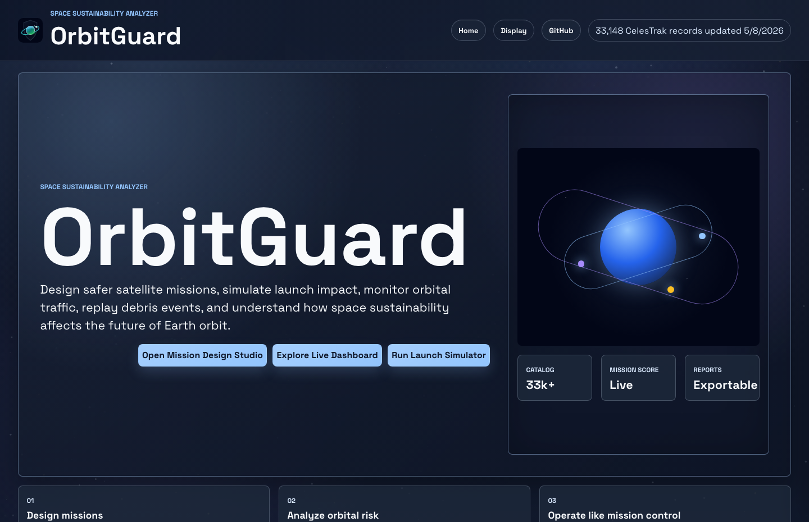
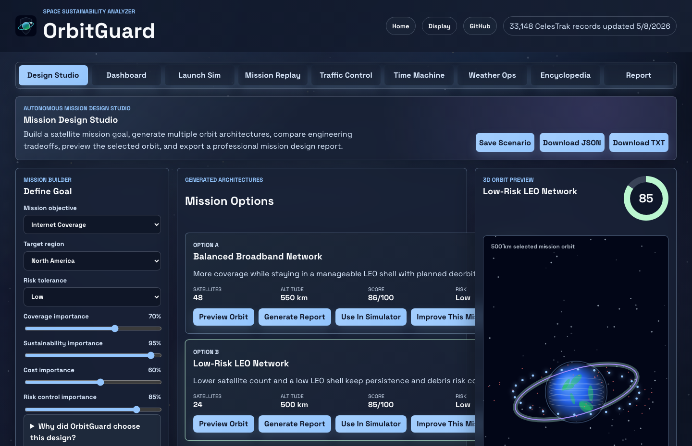
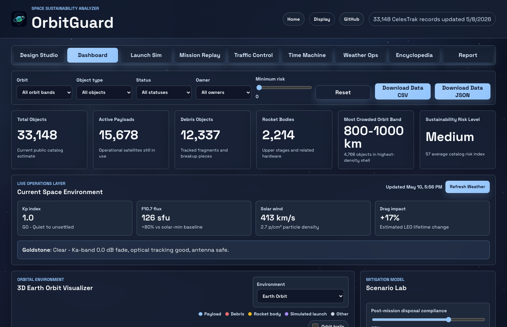
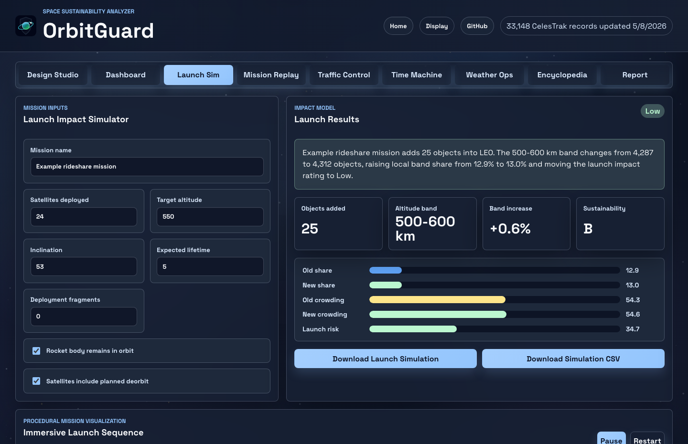
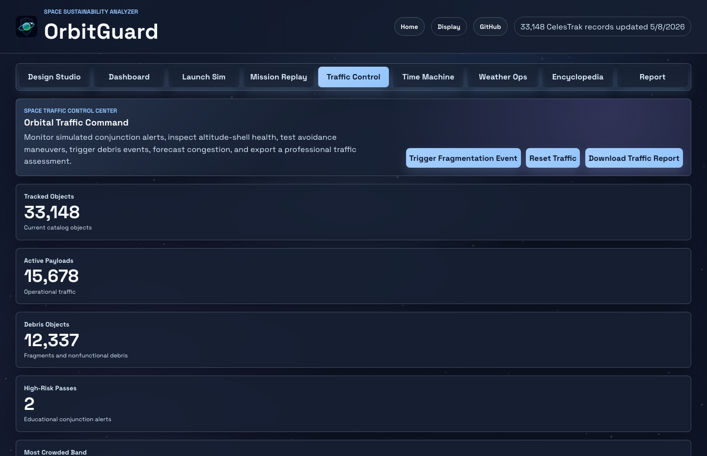

# OrbitGuard


**OrbitGuard is a space sustainability web app that visualizes orbital congestion, simulates satellite launches, and analyzes debris risk using public orbital data.**

Built by **Harshith Pranav Praveen**.

[Live Demo](https://orbitguard.vercel.app) · [API Docs](docs/API.md) · [Roadmap](docs/ROADMAP.md) · [Testing Checklist](docs/TESTING.md) · [GitHub Launch Plan](docs/GITHUB_LAUNCH_PLAN.md)



## Why OrbitGuard Exists

Earth orbit is becoming more crowded with satellites, debris fragments, and rocket bodies. OrbitGuard turns that problem into an interactive platform where users can inspect orbital traffic, design satellite missions, replay launch events, and understand how engineering decisions affect long-term space sustainability.

The project is not an operational collision prediction system. It is a transparent educational and portfolio-grade analyzer for learning about orbital congestion, launch impact, debris risk, and responsible mission design.

## What It Does

- **Autonomous Mission Design Studio**: generate satellite mission architectures, compare tradeoffs, preview orbit designs, save scenarios, and export reports.
- **Live Orbit Dashboard**: explore CelesTrak catalog summaries, altitude bands, object types, crowded shells, and a 3D Earth orbit viewer.
- **Launch Impact Simulator**: test satellite count, altitude, inclination, lifetime, fragments, deorbit planning, and rocket-body disposal.
- **Mission Replay Mode**: watch simulated launch phases, orbit insertion, payload deployment, risk changes, and mission autopsy summaries.
- **Space Traffic Control Center**: inspect simulated conjunction alerts, avoidance maneuvers, traffic forecasts, operator status, and command logs.
- **Time Machine**: compare historical launch-year reconstructions against today's orbital catalog.
- **Weather Ops**: show NOAA space-weather conditions and ground-station weather effects on communications and tracking.
- **Space Encyclopedia**: browse 200 curated aerospace and space-sustainability topics with search, filters, article generation, and fact-checking.
- **Reports and Exports**: download JSON, CSV, KML, and TXT reports from major app modes.

## Screenshots

| Mission Design Studio | Orbit Dashboard |
| --- | --- |
|  |  |

| Launch Simulator | Space Traffic Control |
| --- | --- |
|  |  |

## What Makes It Impressive

OrbitGuard combines several ideas that are usually separate:

- Public aerospace data from CelesTrak and NOAA
- A browser-based mission design and launch-impact simulator
- 3D-style orbit and mission visualizations built without heavy model downloads
- Downloadable reports for missions, traffic simulations, weather snapshots, and sustainability summaries
- Honest limitations so the app does not pretend to be flight-certified software
- A polished public demo, API structure, documentation, roadmap, testing checklist, and contribution guide

## Tech Stack

- **Frontend:** HTML, CSS, JavaScript
- **Backend/local API:** Node.js
- **Data:** CelesTrak SATCAT, NOAA SWPC, educational weather/mission models
- **Deployment:** Vercel static hosting with lightweight API structure
- **Exports:** JSON, CSV, KML, TXT

## Run Locally

```bash
git clone https://github.com/harshithpr/orbitguard.git
cd orbitguard
npm install
npm run build
npm start
```

Then open:

```text
http://localhost:4173
```

On macOS, you can also double-click:

```text
Run OrbitGuard.command
```

## Update The Orbital Dataset

```bash
npm run update-data
```

This downloads public CelesTrak SATCAT data, filters non-decayed Earth-orbiting objects with usable apogee/perigee data, and writes:

```text
data/orbitguard-data.json
```

## API Preview

OrbitGuard includes local API endpoints for platform-style use:

```text
GET  /api/v1/health
GET  /api/v1/summary
GET  /api/v1/objects?band=500-600&type=debris
GET  /api/v1/bands?size=100
GET  /api/v1/time-machine?year=2005
GET  /api/v1/weather/space
GET  /api/v1/sustainability?satellites=24&altitude=550&inclination=53
POST /api/v1/simulate
```

See [docs/API.md](docs/API.md) for the full API documentation.

## Roadmap

- Add SGP4 propagation from live TLE/GP data
- Add PDF exports for mission reports
- Improve the 3D orbit viewer with more efficient level-of-detail rendering
- Add historical debris event replay datasets
- Add a Kessler cascade simulator
- Add satellite pass prediction by user location
- Expand the Space Traffic Control Center with more maneuver scenarios
- Replace educational drag scaling with a full atmospheric-density model

## Contributing

Contributions are welcome. Good first areas:

- Improve mobile layout
- Add screenshots or demo GIFs
- Improve API examples
- Add tests for `src/engines/orbitguard-core.js`
- Improve 3D labels and accessibility
- Suggest aerospace features with clear sources and limitations

Read [CONTRIBUTING.md](CONTRIBUTING.md) before making a large change.

## Project Status

OrbitGuard is actively maintained as a high school aerospace engineering portfolio project. The current version is designed for public education, data visualization, and mission-design exploration.

## License

MIT License. See [LICENSE](LICENSE).
